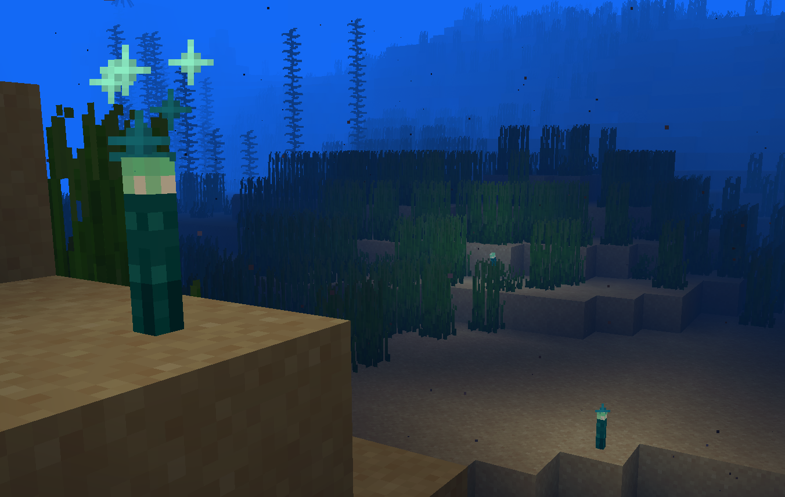

# Glow Torches

**Glow Torches** is a lightweight and vanilla-friendly mod that adds waterproof torches to Minecraft. The titular **Glow Torches** can be crafted with Glow Ink Sacs and function just like regular torches, except that they can be placed underwater!

They're not quite as bright as regular torches, having a light level of 12, but they have a unique appearance and sparkle nicely. And since Glow Squids can be difficult to find, this mod also adds a recipe to combine regular Ink Sacs with Glowstone Dust to create Glow Ink Sacs.

## Recipes

 

## Usage

- You're more than welcome to use this mod in any modpacks! 
- All of the original code in this project is licensed under the GPL-3.0, so you're free to use it or copy it as you see fit, as long as you also open source any projects you release that include it
- Attribution is appreciated but not required

## Acknowledgements

- The idea for this mod came from Nekoma's ["I Fixed "USELESS" Minecraft Features"](https://www.youtube.com/watch?v=lYRpvjmH6Q8) video
- I referenced realmayus' code for their [Aquatic Torches mod](https://github.com/realmayus/aquatictorches) while working on this, although all the code for this mod was written from scratch
